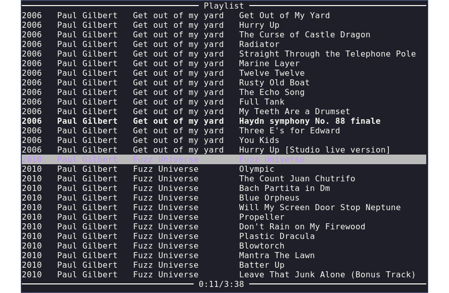

What is `hmc`
-------------

`hmc` is a
[Music Player Daemon](https://www.musicpd.org/)
client with a simple interface inspired by
[billy](http://www.sheepfriends.com/index-page=billy.html).

Warning: This program is in an early stage of development.

Install
-------

Currently you have to build it yourself with [stack](https://docs.haskellstack.org/en/stable/README/).

    git clone https://github.com/OndrejSlamecka/hmc.git && cd hmc
    stack build
    stack exec hmc

Controls
--------

* There are three views: Help (`F1`, `F12`), Playlist (`F2`, `Esc`), Browser (`F3`
  adding mode, `F4` opening mode).
* You can exit with `q` or `Ctrl-d`, if you want to keep the music
  playing then exit with `Ctrl-q`.
* In lists move up and down with arrows, press `enter` to play/(add/open),
  spacebar to (un)pause, `Tab` to play the next song. In playlist left
  and right arrows are used to seek in the song, in browser to
  enter/leave directory.
* You can use `gg`, `G`, `Ctrl-f` or `PageDown`, `Ctrl-b` or `PageUp`, `Shift-up`,
  `Shift-down` to move faster in lists.
* Remove the selected song from playlist with Del.
* Search with `/` or `s` and leave search with `Esc`.
* Control volume with `+` and `-` (if you have MPD configured to control volume).

TODO
----

* Fix: Repeated timer kills just before ticks can lead to drift from actual elapsed time (when starting progress timer, status should be fetched from MPD?)
* Playing queue (like billy has).
